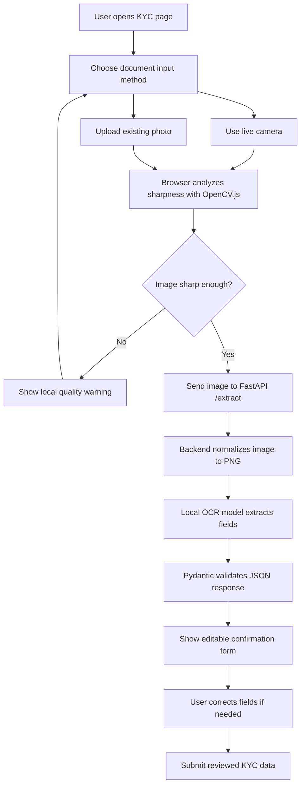
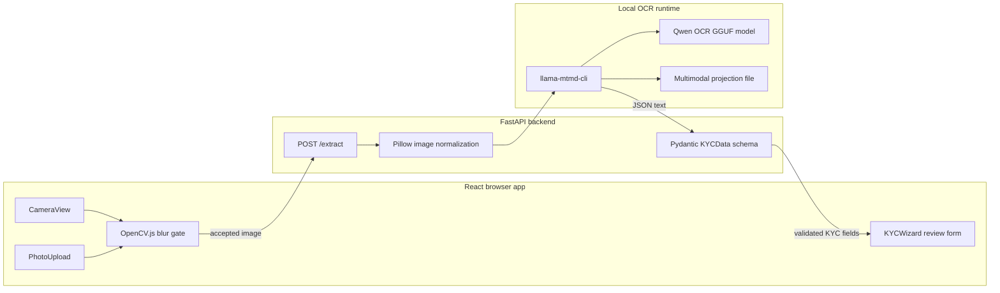

# Intelligent KYC Experience

A prototype KYC onboarding flow for the eSewa x WWF 2026 Challenge 4: **Smart Form Assistance and Support Ticket Reduction**.

The app helps users submit clearer identity document images, extracts basic KYC fields with local OCR, and gives users a review screen before final submission. It focuses on one common source of KYC failure: users manually entering data from unclear or poorly captured documents.

## Problem statement

Digital KYC often fails before verification teams can review the application. Users mistype names, enter the wrong document number, upload blurry images, or leave the flow because they do not know what went wrong. Each failed attempt creates friction for the user and extra work for support and operations teams.

This project addresses the document-capture and form-assistance part of that problem. It reduces manual typing, blocks low-quality document images before upload, and asks users to confirm extracted data instead of filling the full form from scratch.

## Why this matters

KYC is usually a required step before a user can access financial services. A slow or confusing KYC flow can cause:

- incomplete onboarding
- repeated document submissions
- wrong or inconsistent customer data
- higher support ticket volume
- delayed access to wallets, payments, or other account features

A better KYC experience should catch preventable errors early. It should also explain what the user needs to do next instead of making them wait for a rejection.

## What this project does

The current prototype provides a browser-based KYC document flow:

1. The user chooses a document input method:
   - live camera capture
   - upload of an existing document photo
2. The browser checks image sharpness with OpenCV.js.
3. The app blocks blurry images before upload.
4. The frontend sends only accepted images to the FastAPI backend.
5. The backend normalizes the image and sends it to a local multimodal OCR model.
6. The model returns structured JSON fields.
7. Pydantic validates the extracted fields.
8. The user reviews and edits the extracted KYC data before submission.

Extracted fields:

- full name
- age
- sex
- address
- document number

## Scope

### Covered

- Live document capture from the browser camera.
- Existing document photo upload.
- Client-side blur detection using Variance of Laplacian.
- Local quality threshold adjustment for demos and testing.
- Multipart image upload to a backend API.
- Image normalization to RGB PNG before OCR.
- Local OCR execution through `llama-mtmd-cli`.
- Strict JSON extraction for core KYC fields.
- User review and correction before final submission.
- Basic frontend test coverage for the two input paths.

### Not covered

This prototype does not implement the full regulated KYC lifecycle. It does not include:

- production identity verification rules
- sanctions, watchlist, or fraud checks
- selfie capture or liveness detection
- face matching
- document authenticity detection
- database persistence
- user authentication
- admin review queues
- asynchronous approval or rejection workflows
- SMS, email, or push notifications
- production monitoring and audit trails

The project improves the user-facing capture and data-entry experience. It does not replace compliance review or core KYC decisioning.

## End-to-end user journey



## User experience sketch

### Step 1: choose capture method

```text
┌──────────────────────────────────────────────────────────────┐
│ Intelligent KYC Experience                                  │
│ Capture a clear document image to auto-fill your KYC form.   │
├──────────────────────────────┬───────────────────────────────┤
│ Document camera              │ Existing document photo        │
│                              │                               │
│ ┌──────────────────────────┐ │ ┌───────────────────────────┐ │
│ │ Live camera preview       │ │ │ Upload preview             │ │
│ │                          │ │ │                           │ │
│ │  ID document in frame     │ │ │  Selected image appears    │ │
│ └──────────────────────────┘ │ └───────────────────────────┘ │
│                              │                               │
│ Sharpness score: 148         │ Sharpness score: 132          │
│ Threshold: [------|-----]    │ Threshold: [------|-----]     │
│                              │                               │
│ [Capture document]           │ [Use this photo]              │
└──────────────────────────────┴───────────────────────────────┘
```

### Step 2: analyze document

```text
┌─────────────────────────────────────────────┐
│ Analyzing document                          │
│                                             │
│ The accepted image is being processed by    │
│ the local OCR backend.                      │
└─────────────────────────────────────────────┘
```

### Step 3: review extracted fields

```text
┌─────────────────────────────────────────────┐
│ Confirm your KYC details                    │
│                                             │
│ Full name        [DEV MAN HIRACHAN       ]  │
│ Age              [0                       ]  │
│ Sex              [                        ]  │
│ Document number  [KATH-B/1                ]  │
│ Address          [Osaka, Japan            ]  │
│                                             │
│ [Submit reviewed details]                   │
└─────────────────────────────────────────────┘
```

## High-level architecture



## Technology stack

### Frontend

- React 19
- Create React App
- React Testing Library
- Browser camera API: `navigator.mediaDevices.getUserMedia`
- File upload API: `<input type="file" accept="image/*">`
- Canvas API for frame and image analysis
- OpenCV.js for blur detection
- Variance of Laplacian for image sharpness scoring

### Backend

- Python
- FastAPI
- Uvicorn
- Pydantic
- `python-multipart` for file uploads
- Pillow for image decoding and PNG normalization

### OCR runtime

- `llama-mtmd-cli` from llama.cpp
- Qwen OCR GGUF model
- GGUF multimodal projection file
- JSON-schema constrained OCR output

## Repository layout

```text
.
├── backend/
│   ├── main.py              # FastAPI app with /health and /extract
│   ├── ml_engine.py         # Image normalization and local OCR execution
│   ├── schemas.py           # Pydantic KYC response schema
│   └── requirements.txt     # Backend Python dependencies
├── kyc-app/
│   ├── public/
│   └── src/
│       ├── components/
│       │   ├── CameraView.jsx
│       │   ├── PhotoUpload.jsx
│       │   └── KYCWizard.jsx
│       ├── utils/
│       │   └── cv.js        # OpenCV.js loader hook
│       ├── App.css
│       ├── App.js
│       └── App.test.js
└── README.md
```

## Backend API

### `GET /health`

Returns a simple health response.

```json
{ "status": "ok" }
```

### `POST /extract`

Accepts a multipart image upload under the field name `file`.

The endpoint:

1. rejects non-image uploads
2. rejects empty uploads
3. normalizes the image to RGB PNG
4. calls the local OCR runtime
5. validates the OCR JSON against `KYCData`
6. returns structured KYC fields

Example response:

```json
{
  "name": "DEV MAN HIRACHAN",
  "age": 0,
  "sex": "",
  "address": "Osaka, Japan",
  "document_number": "KATH-B/1"
}
```

## Local setup

### Prerequisites

Install or prepare:

- Node.js and npm
- Python 3
- a local `llama.cpp` build with `llama-mtmd-cli`
- the OCR GGUF model file
- the OCR multimodal projection GGUF file

The backend has default local paths in `backend/ml_engine.py`:

```text
/home/bindesh/kyc/llama-cpp-python/Qwen-3.5-0.8B-OCR.Q8_0.gguf
/home/bindesh/kyc/llama-cpp-python/Qwen-3.5-0.8B-OCR.mmproj-f16.gguf
/home/bindesh/Desktop/llama.cpp/build/bin/llama-mtmd-cli
```

You can override them with environment variables:

```bash
export KYC_MODEL_PATH=/path/to/model.gguf
export KYC_MMPROJ_PATH=/path/to/mmproj.gguf
export KYC_MTMD_CLI_PATH=/path/to/llama-mtmd-cli
export KYC_MAX_TOKENS=256
export KYC_OCR_TIMEOUT=300
```

### Install backend dependencies

```bash
cd backend
python -m venv .venv
source .venv/bin/activate
pip install -r requirements.txt
```

### Start the backend

```bash
cd backend
source .venv/bin/activate
uvicorn main:app --host 127.0.0.1 --port 8000 --reload
```

Verify the backend:

```bash
curl http://127.0.0.1:8000/health
```

Expected response:

```json
{ "status": "ok" }
```

### Install frontend dependencies

```bash
cd kyc-app
npm install
```

### Start the frontend

```bash
cd kyc-app
npm start
```

Open the app at:

```text
http://localhost:3000
```

## Manual browser test

1. Start the backend on port `8000`.
2. Start the React app on port `3000`.
3. Open `http://localhost:3000`.
4. Test live camera capture:
   - allow camera permission
   - point the camera at a document
   - blur or move the document and confirm the capture button is blocked
   - hold the document steady and confirm the capture button becomes available
   - capture the document and confirm the app moves to analysis, then review
5. Test existing photo upload:
   - choose an image from disk
   - confirm the preview appears
   - confirm the sharpness score appears
   - upload a blurry image and confirm it is blocked locally
   - upload a sharp document image and confirm it reaches the review form
6. Edit one or more extracted fields on the confirmation screen.
7. Submit the reviewed data.

## Validation commands

Run frontend tests:

```bash
cd kyc-app
npm test -- --watchAll=false
```

Build the frontend:

```bash
cd kyc-app
npm run build
```

Smoke-test the backend:

```bash
cd backend
source .venv/bin/activate
uvicorn main:app --host 127.0.0.1 --port 8000
```

Then call:

```bash
curl http://127.0.0.1:8000/health
```

## Design notes

### Why use a local blur gate?

The app checks blur in the browser before upload because users can fix image quality immediately. This avoids sending obviously bad images to OCR and reduces avoidable backend work.

### Why support both camera and upload?

Users do not always complete KYC in one sitting. Some users already have a document photo on their device. Supporting both paths makes the flow more flexible while keeping the same quality standard for each image.

### Why require user review?

OCR can misread names, addresses, or document numbers. The confirmation step keeps the user in control and prevents the app from submitting extracted data blindly.

## Known limitations

- OCR quality depends on the local model, document type, lighting, and image resolution.
- The frontend depends on OpenCV.js loading in the browser.
- Large uploads may take longer to preview, analyze, or process.
- The app currently sends images to a local backend URL: `http://localhost:8000/extract`.
- The final submit action is a prototype completion state, not a persisted production submission.
- The project does not yet show a full post-submission verification timeline.

## Future work

- Add persistent KYC applications and review status.
- Add clearer rejection reason screens and next-step guidance.
- Add document-type selection and field-specific validation.
- Add selfie capture and liveness checks.
- Add document authenticity checks.
- Add server-side image size limits and resizing.
- Add production configuration for API base URLs.
- Add audit logging and admin review tools.
